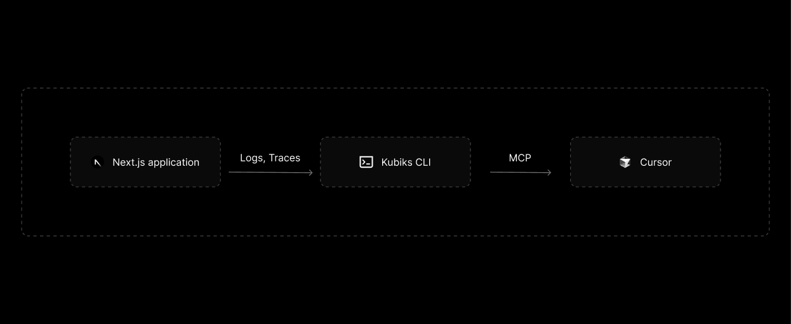
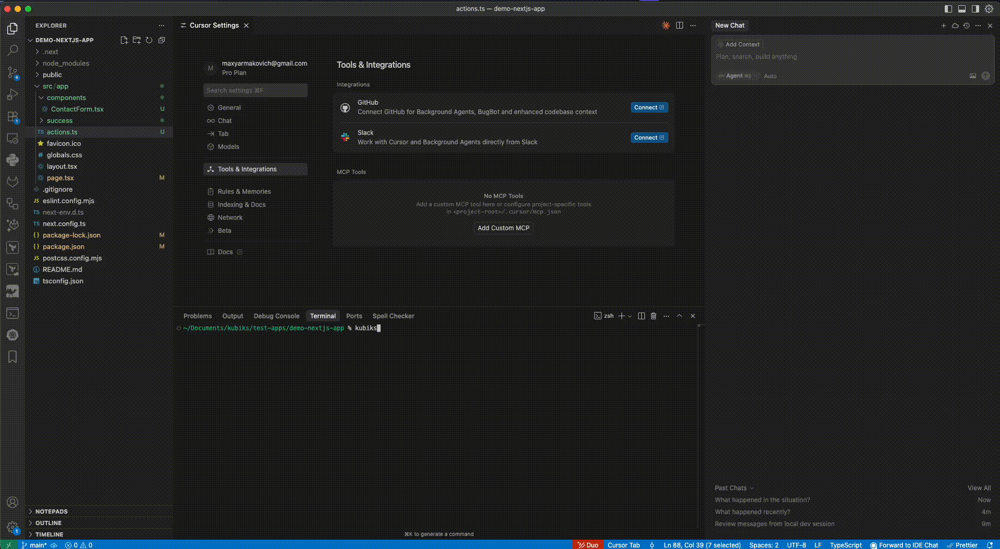

# Kubiks CLI

[](https://github.com/kubiks-inc/kubiks-cli/actions/workflows/test.yml)

**AI-powered debugging for Next.js applications.** Automatically instrument your app, capture all logs, traces, and requests, then let Cursor fix bugs with full context.

## 🎯 What is Kubiks CLI?

When something breaks in your Next.js app, wouldn't it be amazing if your AI code editor could see exactly what happened? **Kubiks CLI makes this possible.**

- 🔍 **Auto-instrument** your Next.js application with zero config
- 📊 **Capture everything**: HTTP requests, SQL queries, AI SDK calls, server/client logs
- 🤖 **Feed Cursor** complete context through MCP (Model Context Protocol)  
- ⚡ **Debug faster**: Ask Cursor to fix issues with full trace data and request payloads

## ✨ The Developer Experience

```bash
# Start developing with full observability
kubiks 

# When something breaks, just ask Cursor:
# "Why is my API failing?" 
# Cursor sees the exact HTTP request, response, database queries, and stack traces
```

## 📊 How It Works



*Kubiks CLI automatically instruments your Next.js app, captures telemetry data, and makes it available to Cursor through MCP for AI-powered debugging.*

## 🚀 Core Features

- **🔧 Zero-configuration instrumentation** for Next.js applications
- **📡 Real-time telemetry collection** (logs, metrics, traces)
- **🗄️ Local SQLite storage** with intelligent querying
- **🤖 MCP integration** for seamless AI editor support
- **🌐 Cross-platform** support (macOS, Linux, Windows)

## 🔥 Quick Start

### Install via Homebrew (macOS/Linux)

```bash
brew install kubiks-inc/tap/kubiks
```

### Or download for your platform
[⬇️ Download from releases](https://github.com/kubiks-inc/kubiks-cli/releases)

### Start debugging like a pro

```bash
# In your Next.js project directory
kubiks 
```

### 💡 Pro Tip: Enable Browser Logs

For the best debugging experience, we highly recommend adding this to your `next.config.js`:

```javascript
/** @type {import('next').NextConfig} */
const nextConfig = {
  experimental: {
    // Forward browser logs to the terminal for easier debugging
    browserDebugInfoInTerminal: true,
  },
}

module.exports = nextConfig
```

This enables Cursor to see browser logs alongside server logs for complete visibility.

> 💡 This feature is part of Next.js's experimental browser log forwarding designed to support AI-powered debugging workflows. Learn more in the [Next.js 15.4 blog post](https://nextjs.org/blog/next-15-4#preview-upcoming-features).

That's it! Now when your app has issues, ask Cursor questions like:
- *"Why is my login API returning 500?"*
- *"What SQL queries are running when users click this button?"*
- *"Show me the full request trace for the checkout flow"*

Cursor will have complete visibility into your application's behavior.

## 🛠️ How It Works

1. **Instrument**: Kubiks automatically adds OpenTelemetry to your Next.js app
2. **Capture**: All HTTP requests, database queries, API calls, and logs are recorded
3. **Store**: Data is stored locally in SQLite for fast querying
4. **Expose**: MCP server provides structured access to all telemetry data
5. **Debug**: Cursor queries this data to understand and fix issues


## 🎬 Demo



*Watch Kubiks CLI in action: automatic instrumentation, real-time telemetry capture, and AI-powered debugging with Cursor.*

### Try it yourself:

```bash
# Terminal 1: Start your instrumented Next.js app
cd my-nextjs-app
kubiks 

# Now in Cursor, ask:
# "My API endpoint /api/users is slow, what's happening?"

# Cursor responds with:
# "I can see from the traces that your /api/users endpoint is making 
# 3 separate database queries taking 450ms total. Here's the optimization..."
```

## 🏗️ What Gets Captured

- **🌐 HTTP Requests**: Full request/response cycles with headers and payloads
- **🗄️ Database Queries**: SQL statements, execution time, and results
- **🤖 AI SDK Calls**: LLM calls, Tool calls, prompts, responses.
- **📝 Application Logs**: Both server-side and client-side logging
- **⚡ Performance Metrics**: Response times, memory usage, and bottlenecks
- **🔗 Distributed Traces**: End-to-end request flows across your stack

## 🔧 Configuration

Kubiks works out of the box with zero configuration. It automatically:
- Detects Next.js projects
- Configures OpenTelemetry instrumentation
- Sets up local data storage
- Exposes MCP endpoints for Cursor

For advanced use cases, you can customize ports and data retention policies.

## 🎯 Why Kubiks?

**Traditional debugging**: Look at logs, add console statements, refresh browser, repeat...

**Kubiks + Cursor**: Ask "What's wrong?" and get a complete analysis with full context.

## 🤝 Contributing

We welcome contributions! This is an open-source project built for the developer community.

### Quick Development Setup

```bash
git clone https://github.com/kubiks-inc/kubiks-cli.git
cd kubiks-cli
make deps
make test
make build
```

### Areas We Need Help
- 🔌 Framework integrations (React, Vue, Angular)
- 🗄️ Database connectors (Postgres, MongoDB, etc.)
- 🤖 Additional AI SDK instrumentation
- 📊 Enhanced visualization and querying
- 🐛 Bug reports and feature requests

## 📚 Learn More

- **[MCP Protocol](https://github.com/modelcontextprotocol/specification)**: How Cursor communicates with Kubiks
- **[OpenTelemetry](https://opentelemetry.io/)**: The instrumentation standard we use
- **[Next.js](https://nextjs.org/)**: The framework we currently support (more coming!)

## 🌟 Star us!

If Kubiks helps you debug faster, please star the repo! It helps other developers discover this tool.

[⭐ Star on GitHub](https://github.com/kubiks-inc/kubiks-cli)

## 📄 License

Apache 2.0 License - see [LICENSE](LICENSE) file for details.

## 🛟 Support & Community

- 🐛 [Report issues](https://github.com/kubiks-inc/kubiks-cli/issues/new/choose)
- 💡 [Request features](https://github.com/kubiks-inc/kubiks-cli/issues/new/choose)
- 💬 [Join discussions](https://github.com/kubiks-inc/kubiks-cli/discussions)
- 📧 Email: [support@kubiks.ai](mailto:support@kubiks.ai)

---

**Made with ❤️ by developers, for developers.** Happy debugging! 🐛✨